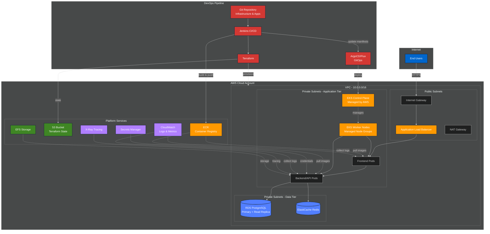

# 3-Tier EKS Infrastructure — Architecture & Roadmap

## Goal
Design and implement a production-ready 3-tier infrastructure (web, application, data) on AWS using Terraform and EKS for application deployment.

## Architecture Diagram



## Tier mapping
- **Presentation (Web)**: ALB + Frontend pods in EKS (public-facing via ALB).
- **Application (App/API)**: Backend pods in EKS running in private subnets.
- **Data (DB/Cache)**: RDS and ElastiCache in private subnets.

## Terraform repo layout (recommended)
```
repo-root/
├── README.md
├── infra/
│   ├── environments/
│   │   ├── dev/
│   │   │   ├── main.tf
│   │   │   ├── backend.tf
│   │   │   └── terraform.tfvars
│   │   ├── staging/
│   │   └── prod/
│   └── modules/
│       ├── network/
│       │   ├── main.tf
│       │   ├── variables.tf
│       │   └── outputs.tf
│       ├── eks/
│       │   ├── main.tf
│       │   ├── variables.tf
│       │   └── outputs.tf
│       ├── node_group/
│       ├── alb_ingress/
│       ├── rds/
│       ├── monitoring/
│       └── iam/
├── apps/
│   └── (application repositories, Helm charts / k8s manifests)
└── ci/
    └── (Jenkinsfiles, pipelines, scripts)
```

**Notes:**
- Keep infra "modules" reusable and parameterized per environment.
- Use a remote backend (S3 + DynamoDB locking).
- Separate state per environment/account.

## Phased Roadmap (recommended timeline & checks)

### Phase 0 — Planning (0.5–1 week)
- Identify accounts: dev/staging/prod; choose AWS partition/regions.
- Define VPC CIDR plan, subnet sizing, AZs.
- Decide node types: managed node groups vs Fargate vs mixed.
- Security & compliance requirements: encryption, logging, audit.

### Phase 1 — Bootstrap infra + remote state (1 week)
- Create S3 bucket + DynamoDB table for .tf state locking (manually or via a tiny bootstrap script).
- Create CI user/role with limited permissions to run Terraform.
- Verify remote state read/write and locking.

### Phase 2 — Network module (1–2 weeks)
- Implement Terraform network module: VPC, public/private subnets across AZs, NAT Gateway, route tables.
- Outputs: subnet ids, route table ids, endpoint ids.
- Test: launch a simple EC2 instance into subnets (smoke test).

### Phase 3 — EKS base (1–2 weeks)
- Implement eks module:
  - `aws_eks_cluster` (managed control plane)
  - OIDC provider for IRSA
  - `aws_iam_role` for cluster
  - Core add-ons: aws-load-balancer-controller, metrics-server, cluster-autoscaler (via helm provider or eks addons)
- Create managed node groups or Fargate profiles.
- Test: deploy a sample nginx pod via kubectl.

### Phase 4 — Platform integrations (1–2 weeks)
- Deploy ALB ingress controller (AWS LB Controller)
- Setup ECR lifecycle & permissions
- Enable CloudWatch Container Insights / Fluent Bit logs
- Implement IAM roles for Service Accounts (IRSA) for app integrations (S3, SecretsManager, SSM)

### Phase 5 — Data tier & security (1–2 weeks)
- Implement RDS module (multi-AZ, subnet group, encrypted)
- Implement ElastiCache module
- Configure security groups and least privilege rules
- Add network ACLs, restrict public access

### Phase 6 — CI/CD & GitOps (1–2 weeks)
- CI pipeline builds container images, pushes to ECR, runs security scans.
- **Option A**: Jenkins deploys helm charts directly to clusters (needs kubeconfig/assume role).
- **Option B (recommended)**: CI updates a GitOps repo (manifests/helm values) and ArgoCD/Flux applies to cluster.
- Implement promotion flow (dev → staging → prod) and manual approvals.

### Phase 7 — Observability, SLOs, and hardened production (ongoing)
- Add Prometheus/Grafana or managed monitoring, tracing, centralized logging.
- Add image signing (cosign) & runtime security (Falco, OPA/Gatekeeper).
- Audit & backups (RDS snapshots, S3 lifecycle).

## Key recommendations & best practices
- ✅ Use OIDC + IRSA — never mount AWS creds into pods.
- ✅ Use immutable image tags (SHA) and artifact promotion between environments.
- ✅ Keep Terraform modules focused: network, compute (eks), storage (rds), platform (ingress, monitoring).
- ✅ Enable automated backups & encryption for data stores.
- ✅ Least-privilege for Terraform CI user/role; separate principals for environments.
- ✅ Use multiple AWS accounts for environment separation (centralized tooling account for CI/terraform state bucket).
- ✅ Use CI for infra plan validation (terraform plan + policy checks) and require human approval before terraform apply to prod.
- ✅ Automate cluster add-ons with Helm or eksctl/terraform-managed helm providers.

## Example terraform workflow
1. Work on `infra/modules` in feature branch.
2. Run `terraform init` with remote backend.
3. Create PR — CI runs `terraform fmt`, `terraform validate`, `terraform plan`.
4. When PR is approved, apply in non-prod automatically or trigger apply via pipeline.
5. For prod apply, require manual approval and run `terraform apply` in CI or a controlled workspace.

## Next actions (practical)
- ✅ Choose one environment to bootstrap first (dev).
- ✅ Create the remote state bucket & locking table.
- ✅ Implement the network module and run `terraform apply` to create VPC/subnets.
- ✅ Implement EKS module and validate with a sample application.

---

**Document created by**: @gauravumrane29  
**Last updated**: 2025-11-19 07:11:32 UTC
